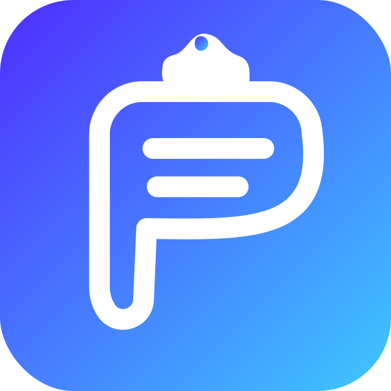

<p align="center">
  
</p>

# Plokee

**Private clipboard sync for your devices.**

Plokee securely syncs text, images, and files between your devices on the
same local network. There is no account, cloud storage, or central server:
paired devices communicate directly with each other.

**Platforms:** macOS · Windows · Linux · Android · iOS

## Features

- Automatic clipboard syncing on desktop platforms.
- Text, PNG image, and file transfer up to 32 MB per clipboard item.
- Secure device pairing with a human-verifiable six-digit code.
- Automatic local-network discovery using Bonjour/mDNS and UDP multicast.
- End-to-end encrypted transport between paired devices.
- Local history of the latest 100 clipboard items.
- Desktop tray menu with sync status, recent clipboard items, quick clipboard
  checks, and sync controls.
- Custom device names and paired-device management.
- Received files are saved to `Downloads/Plokee` on desktop and to the app
  documents directory on mobile.

## Supported platforms

| Platform | Status    | Notes                                                             |
| -------- | --------- | ----------------------------------------------------------------- |
| macOS    | Supported | Automatic clipboard watching and system tray support.             |
| Windows  | Supported | Automatic clipboard watching and system tray support.             |
| Linux    | Supported | Automatic clipboard watching and system tray support.             |
| Android  | Supported | Clipboard access is available while the app is in the foreground. |
| iOS      | Supported | iOS may ask for paste permission; manual sending is the default.  |

## How it works

1. Start Plokee on two devices connected to the same network.
2. The devices discover one another automatically.
3. Select a device and compare the same six-digit verification code on both
   screens.
4. Once paired, copy text, an image, or a file on one device and paste it on
   the other.

Closing the desktop window keeps Plokee running in the system tray. Select
**Quit** from the tray menu to exit the application completely.

## Security and privacy

Plokee is designed for direct communication within your local network.

- Device pairing uses X25519 (ECDH) key agreement.
- The six-digit verification code must be checked on both devices; this is
  what protects pairing from man-in-the-middle attacks.
- Clipboard payloads are encrypted with AES-256-GCM. Per-pair keys are
  derived from the shared secret with HKDF.
- Connections use an HMAC-SHA256 challenge-response handshake.
- Network discovery announcements never contain clipboard contents; they only
  expose the public information required to discover a device.
- Pairing secrets and history remain on the local device.

> **Important:** A paired device can receive items copied while sync is
> enabled. Pair only trusted devices and disable sync from the tray menu or
> Settings whenever it is not needed.

## Mobile behaviour

Mobile operating systems limit background clipboard access.

- **Android:** Plokee can read the clipboard while the app is in the
  foreground.
- **iOS:** iOS displays a system paste-permission prompt for clipboard reads.
  Automatic reading on app resume is therefore disabled by default; use the
  in-app send action when you want to share the current clipboard item.

Receiving items works while the app is active on both mobile platforms.

## Downloading releases

Every version tagged as `v*` is built and published automatically by
[GitHub Actions](.github/workflows/release.yml). The corresponding
[GitHub Release](../../releases) contains these assets:

| Platform | Release asset                                                  |
| -------- | -------------------------------------------------------------- |
| macOS    | `Plokee-macos.dmg`                                             |
| Windows  | `Plokee-windows-x64.exe` and `Plokee-windows-x64-portable.zip` |
| Linux    | `Plokee-linux-x64` and `Plokee-linux-x64.tar.gz`               |
| Android  | `Plokee-android-release.apk`                                   |

The Windows `.exe` and Linux executable are provided for direct access. Use
the accompanying portable ZIP/TAR archive for a runnable desktop bundle,
because Flutter desktop applications require files located next to the
executable.

## Creating a release

The release workflow runs whenever a version tag beginning with `v` is pushed.
It builds macOS, Windows, Linux, and Android artifacts, then attaches them to
a GitHub Release.

```bash
# Run checks locally first.
flutter analyze
flutter test

# Create and publish a release.
git tag v1.0.0
git push origin v1.0.0
```

The GitHub Actions workflow needs the default `contents: write` permission in
the repository so it can create the release and upload its assets. Android
release builds currently use the project's configured signing setup. Configure
your production keystore before distributing an APK to end users.

## Development quick start

### Requirements

- [Flutter](https://flutter.dev) 3.35 or newer.
- Dart SDK 3.12 or newer.
- Target-platform tooling: Xcode for macOS/iOS, Android Studio for Android,
  Visual Studio with **Desktop development with C++** for Windows, or GTK
  and Ayatana AppIndicator development dependencies for Linux.

### Install and run

```bash
git clone <repository-url>
cd Plokee
flutter pub get

# List available devices.
flutter devices

# Examples:
flutter run -d macos
flutter run -d windows
flutter run -d linux
flutter run -d android
flutter run -d ios
```

### Quality checks

```bash
flutter analyze
flutter test
```

The test suite covers models, settings, history, cryptography, and an
end-to-end sync scenario.

## Local builds

```bash
# Desktop
flutter build macos --release
flutter build windows --release
flutter build linux --release

# Android
flutter build apk --release
```

For distributable artifacts, use the GitHub Actions release workflow rather
than publishing the raw local build output.

On Debian/Ubuntu, install the Linux dependencies with:

```bash
sudo apt-get update
sudo apt-get install --yes ninja-build libgtk-3-dev libayatana-appindicator3-dev
```

## Project structure

```text
lib/
  main.dart                    # application startup, window, and tray
  src/
    app_state.dart             # application state
    clipboard_service.dart     # clipboard reading and applying
    crypto.dart                # keys, encryption, and authentication
    discovery.dart             # local network device discovery
    sync_engine.dart           # pairing and encrypted transport
    history_store.dart         # local clipboard history
    settings_store.dart        # preferences and paired devices
    models.dart                # protocol and data models
    ui/                        # application interface
assets/
  plokee-logo.svg              # brand logo used by this README
  tray_icon.*                  # system tray icons
.github/workflows/release.yml  # release build and publishing pipeline
test/                          # unit and integration tests
```

## Network requirements

Devices must be on the same local network. If a firewall is enabled, allow:

- UDP multicast: `224.0.0.167:45654`;
- Bonjour/mDNS service discovery: `_plokee._tcp`;
- TCP sync ports: `45655–45675`.

Guest Wi-Fi networks often isolate connected devices. Disable client/AP
isolation if devices cannot discover each other.

## Known limitations

- Files larger than 32 MB are not transferred.
- On macOS, synchronising arbitrary files from the clipboard may require
  relaxed sandbox restrictions in self-distributed builds. Text and images
  work without this change.
- Mobile operating systems restrict clipboard access in the background.
- Plokee is intended for a local network; internet-based remote access is not
  a goal of the current version.

## Roadmap

- [x] Text, image, and file syncing.
- [x] macOS, Windows, Linux, Android, and iOS support.
- [x] Bonjour/mDNS discovery and secure pairing.
- [x] Desktop tray controls and access to recent clipboard items.
- [ ] Android quick settings and more complete foreground-service controls.
- [ ] iOS Share Extension, Shortcuts, and Widget support.
- [ ] Per-device sync rules.
- [ ] Additional interface localisations.

## Contributing

Before submitting changes, run `flutter analyze` and `flutter test`. Test
platform-specific functionality on its target platform and update this README
when sync behaviour, release artifacts, or security guarantees change.

## Copyright and licensing

Copyright © 2026 KVLK Studio. All rights reserved.

Licensing terms for distribution and commercial use will be published
separately. Until a dedicated license file is provided, use, copying,
modification, and distribution require written permission from KVLK Studio.
